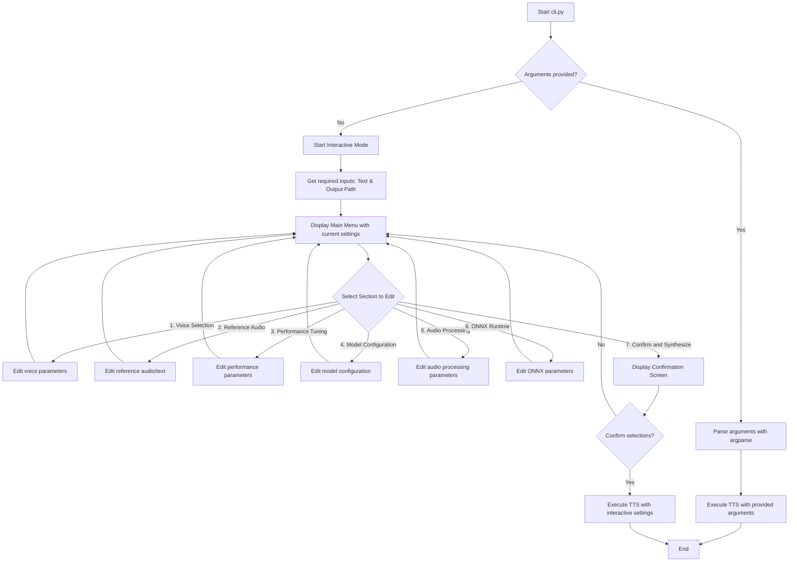

# VietVoice TTS CLI - Interactive Menu Architecture

This document outlines the architecture and design for the interactive menu system in the VietVoice TTS CLI.

## 1. Architectural Diagram

The following diagram illustrates the control flow of the application, handling both non-interactive and interactive modes.

## 2. Section Grouping Rationale

The parameters from `cli.py` are grouped into logical sections as requested to provide an intuitive user experience. This helps users navigate the settings without needing to know all the specific command-line flags.

- **Voice Selection**: Groups core voice characteristics.
- **Reference Audio**: Contains parameters for voice cloning.
- **Performance Tuning**: Manages speed and reproducibility.
- **Model Configuration**: Advanced settings for the underlying model.
- **Audio Processing**: Fine-tunes the audio output characteristics.
- **ONNX Runtime**: Low-level settings for the execution backend.

## 3. Validation Logic Specifications

The interactive menu will replicate the validation logic currently present in `argparse`.

- **Required Inputs**: In interactive mode, `text` and `output` path will be prompted for first, as they are mandatory.
- **Mutual Requirement**:
  - **Rule**: `--reference-audio` and `--reference-text` must be provided together.
  - **Implementation**: The menu will check if one is provided without the other before allowing the user to proceed to the confirmation screen. A warning will be displayed, and the user will be prompted to either provide the missing value or clear both.
- **Enum Constrained Choices**:
  - **Rule**: Parameters like `--gender`, `--area`, etc., are limited to specific values.
  - **Implementation**: The menu will display the available options for these parameters. Input will be validated against the list of allowed choices.
- **Numeric Range/Type Validation**:
  - **Rule**: Parameters like `--speed` expect a float, and others expect integers.
  - **Implementation**: User input will be cast to the appropriate numeric type. `try-except` blocks will handle `ValueError` if the input is not a valid number, prompting the user to re-enter the value.

## 4. Implementation Plan

The implementation has been broken down into the following steps:

1.  **Modify `main` function**: Check if `sys.argv` contains more than just the script name. If not, call a new `run_interactive_mode()` function. Otherwise, proceed with the existing `argparse` logic.
2.  **Create `run_interactive_mode()`**: This function orchestrates the interactive session.
3.  **Implement input prompts**: Helper functions are created to get user input for each parameter type (text, float, integer, choice). These functions handle displaying prompts, default values, and validation.
4.  **Build menu sections**: Functions for each section in the menu display current settings and allow modification.
5.  **Develop the main menu loop**: This loop displays the main menu, shows current settings, and allows the user to select a section to edit or to confirm and proceed.
6.  **Implement the confirmation screen**: Displays all selected settings and asks for final confirmation before synthesis.
7.  **Integrate with TTS core**: The validated and confirmed settings are passed to `create_config` and `TTSApi` to run the synthesis.

## 5. CLI Interactive Mode Enhancements

- **Rich Formatting**: ANSI escape codes are used to provide colored and bold text for better readability and user experience in the terminal.
- **Help Text Update**: The `argparse` help text has been updated to explicitly mention the availability of interactive mode when no arguments are provided.
- **Type Hinting**: Type hints have been added to functions and variables for improved code readability and maintainability, adhering to Python 3.8+ compatibility.
- **Argument Defaults and Validation**: All original `argparse` argument defaults and validation logic have been preserved and replicated within the interactive mode's input collection and confirmation steps.
