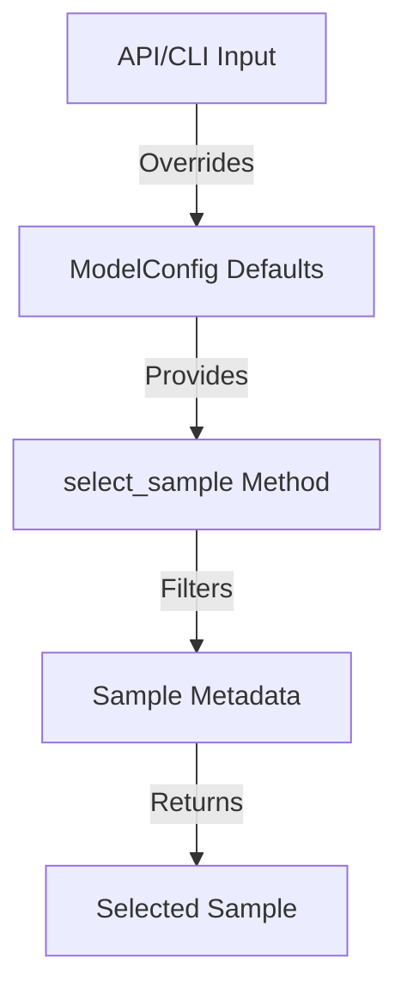

# VietVoice-TTS Architecture

## Overview

This document outlines the architecture of the VietVoice-TTS system, focusing on the configuration schema and sample selection logic.

## Configuration Schema

### ModelConfig

The `ModelConfig` class in [`vietvoicetts/core/model_config.py`](vietvoicetts/core/model_config.py) is the central configuration object for TTS inference. It includes the following sample selection parameters:

- **gender**: Optional[str] = None
- **area**: Optional[str] = None
- **emotion**: Optional[str] = None
- **group**: Optional[str] = None

These parameters allow users to specify default values for sample selection, which can be overridden by API or CLI input.

### Sample Selection Logic

The `select_sample` method in [`vietvoicetts/core/model.py`](vietvoicetts/core/model.py) uses the following priority for parameter resolution:

1. **Explicit Parameters**: Values provided directly to the method take highest priority
2. **ModelConfig Defaults**: If explicit parameters are not provided, the method uses values from `ModelConfig`
3. **None Values**: If neither explicit parameters nor ModelConfig values are provided, the parameter is treated as "any" or "unspecified"

### Interaction Flow



### Backward Compatibility

The implementation maintains backward compatibility by:

- Making all new parameters optional with default values of `None`
- Preserving existing method signatures
- Ensuring that `None` values do not restrict sample selection

### Usage Examples

#### Default Configuration

```python
config = ModelConfig(
    gender="female",
    area="northern",
    emotion="neutral"
)
```

#### Override via Method

```python
# Uses config defaults
sample = manager.select_sample()

# Overrides config defaults
sample = manager.select_sample(gender="male", area="southern")
```

### Validation

All parameters are validated against predefined constants:

- **MODEL_GENDER**: ["male", "female"]
- **MODEL_GROUP**: ["story", "news", "audiobook", "interview", "review"]
- **MODEL_AREA**: ["northern", "southern", "central"]
- **MODEL_EMOTION**: ["neutral", "serious", "monotone", "sad", "surprised", "happy", "angry"]
